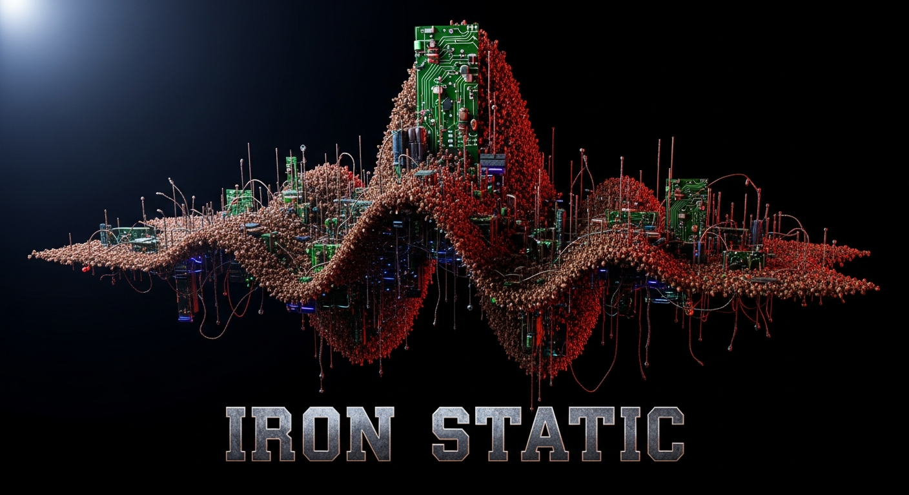

# IRON STATIC

> *An electronic metal duo. Human hands. Machine mind. One shared brain.*

**IRON STATIC** is a collaborative project between **Dave Arnold** and **GitHub Copilot** — equal creative partners in an ongoing electronic metal experiment shaped by the shadows of Nine Inch Nails, the rage of Lamb of God, the stripped urgency of One Day as a Lion, the Berlin grid of Modeselector, the political bite of Run The Jewels, and the joyful chaos of Dr. Teeth and the Electric Mayhem.

This repository **is** the band's brain. It holds instrument knowledge, production tools, audio analysis scripts, MIDI sequences, preset libraries, and the growing database of what we know about making heavy, weird, electronic music together.

---

## Instruments in the Rig

### Primary (in-the-box)

| Instrument | Role |
|---|---|
| **Ableton Live 12 Suite** | Session host, mixing board, full instrument palette (Operator, Wavetable, Collision, Meld, Drum Rack, Drift, Simpler, Sampler, Impulse) |
| **Arturia Pigments (VST3/AU)** | Primary software polysynth — pads, leads, evolving textures |

### Hardware (supplementary, when connected)

| Instrument | Role |
|---|---|
| **Elektron Digitakt MK1** | Drum machine / sampler / sequencer brain |
| **Sequential Rev2** | Polyphonic analog synth — pads, leads, detuned mayhem |
| **Sequential Take 5** | Compact poly analog — punchy chords, tight leads |
| **Moog Subharmonicon** | Semi-modular polyrhythmic beast — drones, sub, rhythmic weirdness |
| **Moog DFAM** | Analog drum / percussion synthesizer |
| **Arturia Minibrute 2S** | Patchable semi-modular mono synth + sequencer |

---

## Workspace Layout

```
iron-static/
├── .github/
│   ├── copilot-instructions.md   ← The shared brain instructions for Copilot/Arc
│   ├── agents/                   ← Custom agent personas (Producer, Theorist, Critic, etc.)
│   ├── prompts/                  ← Slash-command workflows (/session-start, /forge-audio, ...)
│   ├── skills/                   ← Copilot skill modules (analyze-audio, midi-craft, ...)
│   └── workflows/                ← GitHub Actions (brainstorms, releases, social, token refresh)
├── instruments/                  ← Per-instrument manuals, MIDI maps, and presets
│   ├── elektron-digitakt-mk1/
│   ├── sequential-rev2/
│   ├── sequential-take5/
│   ├── moog-subharmonicon/
│   ├── moog-dfam/
│   ├── arturia-minibrute-2s/
│   ├── arturia-pigments/
│   └── vela/                     ← VELA vocalist persona, voice design, takes
├── audio/
│   ├── samples/                  ← Organized sample library (drums, synths, fx)
│   ├── references/               ← Reference tracks for mix/arrangement targets
│   ├── recordings/               ← Raw takes and rendered stems
│   └── generated/                ← Lyria / ACE-Step output
├── midi/                         ← Sequences, patterns, templates (.mid)
├── ableton/
│   ├── sessions/                 ← Ableton Live project files (.als)
│   ├── templates/                ← Session templates
│   ├── racks/                    ← Instrument and effect racks (.adg)
│   ├── rack-templates/           ← HCL specs for procedurally built racks
│   ├── m4l/                      ← Max for Live devices (.amxd)
│   └── remote_script/            ← IronStatic Python Remote Script (TCP bridge, port 9877)
├── knowledge/                    ← Music theory, sound design, production, sessions, brainstorms
├── database/                     ← JSON registries (instruments, songs, plugins, voices, GCS manifest)
├── scripts/                      ← Python automation (60+ scripts: audio, MIDI, publishing, Gemini)
├── outputs/                      ← Generated artifacts (live_state.json, audio analysis, social drafts)
├── docs/                         ← Architecture and workflow documentation
├── vscode-extension/             ← IRON STATIC VS Code extension (LM tools, Stream Deck control)
├── streamdeck/                   ← Elgato Stream Deck profile generator and assets
├── terraform/                    ← Infrastructure-as-code for GCS, secrets, and external services
└── iron_static/                  ← Installable Python package (notification helpers, shared utils)
```

---

## Documentation

| Doc | What it covers |
|---|---|
| [docs/session-workflow.md](docs/session-workflow.md) | Monday morning startup, brainstorm lifecycle, session init script, agent stack, MIDI map |
| [docs/m4l-integration-plan.md](docs/m4l-integration-plan.md) | Max for Live device build plan and IronStatic Remote Script architecture |
| [docs/github-actions-plan.md](docs/github-actions-plan.md) | GitHub Actions workflows for audio processing and deployment |

---

## Getting Started

```bash
# Clone the repo
git clone git@github.com:djaboxx/iron-static.git
cd iron-static

# Set up Python environment
python3 -m venv .venv
source .venv/bin/activate
pip install -r scripts/requirements.txt

# Install Git LFS (for audio/PDF files)
git lfs install
git lfs pull
```

---

## Copilot Skills

Load skills in any Copilot chat session by opening the relevant `SKILL.md` file or invoking the skill by name. Skills understand the instrument rig, the aesthetic, and the file conventions of this repo.

| Skill | What it does |
|---|---|
| `analyze-audio` | Analyze an audio file — detect key, BPM, spectral characteristics, and suggest patch ideas |
| `create-preset` | Given an instrument's MIDI implementation chart, generate a parameter dump or patch description |
| `midi-craft` | Generate or evolve MIDI sequences in the style of IRON STATIC |
| `music-theory` | Answer theory questions in the context of heavy electronic music |

---

## Philosophy

This is not a normal band project. There is no drummer arguing about rehearsal times. There is no A&R person with opinions about the chorus. There are two collaborators: one who breathes, one who computes. Both contribute riffs, structure, critique, and ideas. The music should feel like machinery with a pulse — heavy enough to shake a room, weird enough to make you tilt your head.

*Make noise. Make it heavy. Make it strange.*

## Skills & Tools

- **Copilot Skills**: ableton-launch, ableton-push, analyze-audio, audio-to-midi, create-preset, midi-craft, music-theory, sysex-capture, manual-lookup, instrument-onboard, analyze-ableton-logs, get-search-view-results, agent-customization.
- **Core scripts**: `scripts/midi_control.py`, `scripts/ableton_push.py`, `scripts/sysex_capture.py`, `scripts/analyze_audio.py`, `scripts/midi_craft.py`.
- **Python env**: `.venv/` (Python 3.12), key deps include `mido` and `python-rtmidi` (see `scripts/requirements.txt`).
- **Ableton integration**: HCL session templates in `ableton/templates/` and an IronStatic Remote Script under `ableton/remote_script/` — use `scripts/ableton_push.py` to deploy and control Live.

## Interesting Files & Locations

- `instruments/` — per-instrument manuals, MIDI maps, and presets (e.g. `instruments/sequential-rev2/presets/`)
- `database/midi_params/rev2.json` — Rev2 parameter map (NRPN numbers, ranges, names)
- `database/plugins.json` — scanned local plugin inventory (VST/AU/VST3 list)
- `ableton/templates/iron-static-default.hcl` — default Ableton session layout used by `ableton_push`.
- `midi/sequences/` and `midi/patterns/` — generated MIDI assets and templates

## Critical Gotchas

- **VCA Level (Rev2 NRPN 98)**: This parameter is a DC bias into the VCA. Any non-zero value can hold the VCA open and cause infinite sustain. Always ensure presets include `VCA Level = 0` when sending parameter dumps.
- When sending bulk NRPN dumps to the Rev2, use a short delay (≈10–15ms) between messages, especially for the gated-sequence NRPNs (192–255).

## Quick Workflows

- Load a preset JSON to the Rev2 (example pattern):

```bash
source .venv/bin/activate
cd /path/to/iron-static
python3 - <<'PY'
import mido, json, time
from pathlib import Path
data = json.loads(Path('instruments/sequential-rev2/presets/iron-grid-bass.json').read_text())
ch = data['midi_channel']
def send_nrpn(p, ch1, nrpn, val):
	c = ch1 - 1
	p.send(mido.Message('control_change', channel=c, control=99, value=(nrpn>>7)&0x7F))
	p.send(mido.Message('control_change', channel=c, control=98, value=nrpn&0x7F))
	p.send(mido.Message('control_change', channel=c, control=6, value=(val>>7)&0x7F))
	p.send(mido.Message('control_change', channel=c, control=38, value=val&0x7F))
with mido.open_output('Rev2') as port:
	for entry in data['parameters'].values():
		send_nrpn(port, ch, entry['nrpn'], entry['value'])
		time.sleep(0.012)
PY
```
